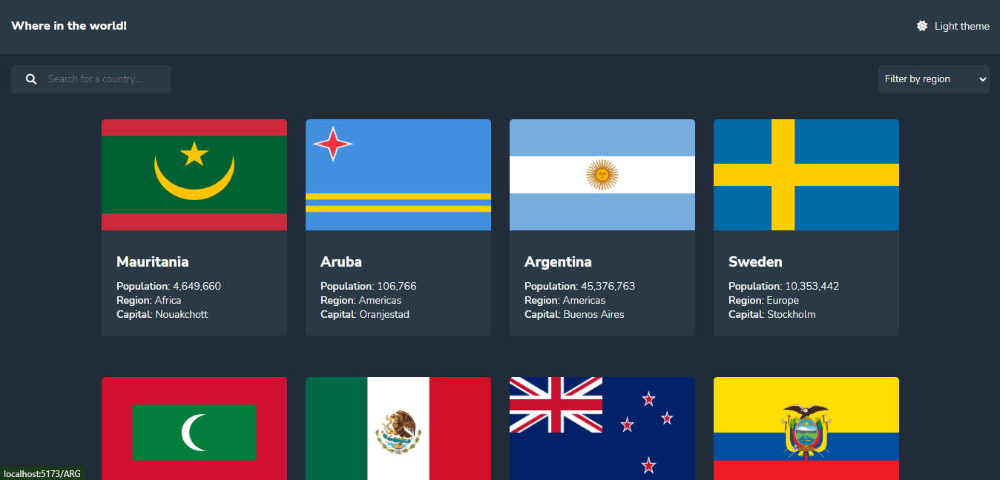
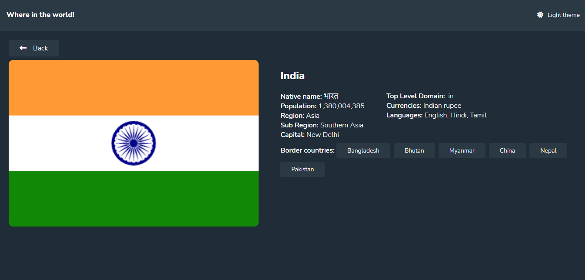
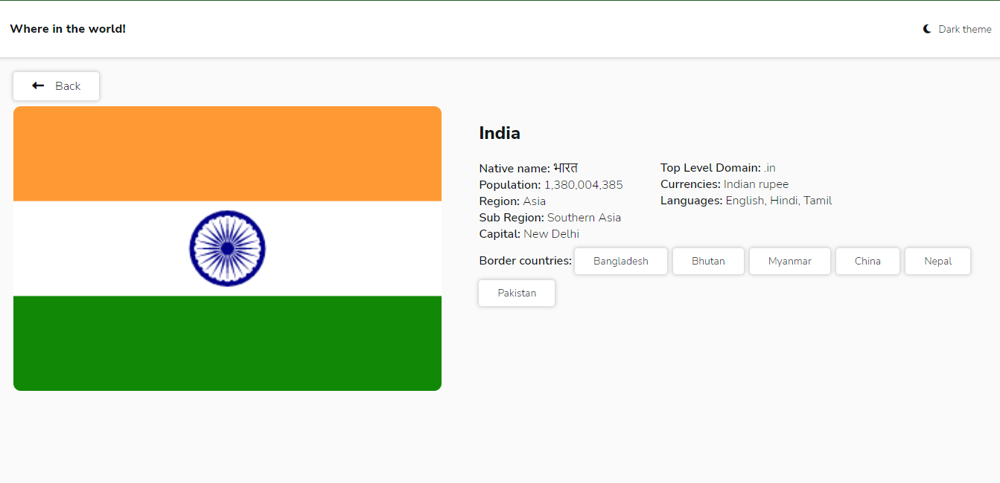

# Frontend Mentor - REST Countries API with color theme switcher solution

This is a solution to the [REST Countries API with color theme switcher challenge on Frontend Mentor](https://www.frontendmentor.io/challenges/rest-countries-api-with-color-theme-switcher-5cacc469fec04111f7b848ca). Frontend Mentor challenges help you improve your coding skills by building realistic projects. 

## Table of contents

- [Overview](#overview)
  - [The challenge](#the-challenge)
  - [Screenshot](#screenshot)
  - [Links](#links)
- [My process](#my-process)
  - [Built with](#built-with)
- [Author](#author)

**Note: Delete this note and update the table of contents based on what sections you keep.**

## Overview

### The challenge

Users should be able to:

- See all countries from the API on the homepage
- Search for a country using an `input` field
- Filter countries by region
- Click on a country to see more detailed information on a separate page
- Click through to the border countries on the detail page
- Toggle the color scheme between light and dark mode 

### Screenshot

### Links

- Solution URL: [Rest Countries Repository](https://github.com/azazel-oss/rest-countries)
- Live Site URL: [Rest Countries Live Site](https://azazel-oss.github.io/rest-countries)

## My process

### Built with

- Semantic HTML5 markup
- CSS custom properties
- Flexbox
- REST API
- Mobile-first workflow
- [React JS](https://reactjs.org/) - JS library
- [React Router](https://reactrouter.com) - React Routing Library
- Context API
- [Vite JS](https://vitejs.dev/) - FrontEnd Tooling

## Author

Asad Mahmood - Full Stack Developer
